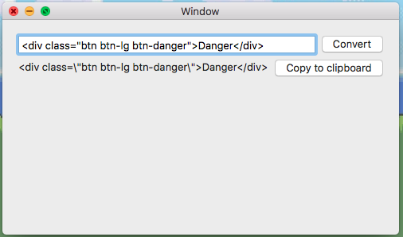

# Double Quote Replacer app
## Introduction
This is a small macOS app that are able to take in a long string, and converted double quote (") into the supported version in a string (\")

## Background story
I always find myself in trouble to replace " into /" when I program in C/C++, and Swift 3,
Although in Swift 4, I am able to use triple quote (""") just like in Python; but I still find this useful sometimes.

## Details
version: 1.0.0
created by: superoo7
created on: 12th June 2017
last update on: 12th June 2017
license: MIT

## Preview

## Contributor
[superoo7](http://github.com/superoo7)

